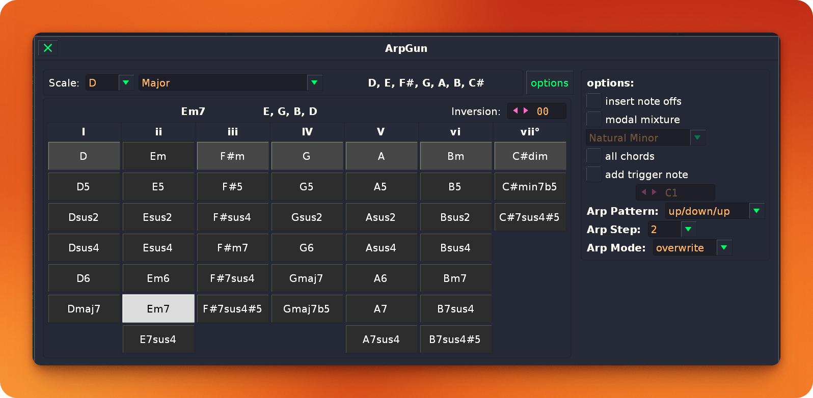

# ArpGun for Renoise

**ArpGun** is a powerful chord and arpeggio generation tool for [Renoise](https://www.renoise.com/), built upon the foundation of the legendary **ChordGun**. It allows you to quickly insert complex chords into your patterns and instantly transform them into a variety of arpeggiated patterns across successive lines.

---

---

## Background

ArpGun is an evolution of **ChordGun**, originally developed by pandabot. While ChordGun focused on rapid chord entry on a single line, ArpGun extends this functionality to support rhythmic "spacing" and melodic movement, making it a complete tool for both harmony and rhythm.

*   **Original Predecessor:** [ChordGun on Renoise Forums](https://forum.renoise.com/t/new-tool-chordgun/50005)

---

## Key Features

-   **Scale-Aware Chord Entry:** Select a key and scale, and ArpGun provides a custom interface of valid chords for that scale.
-   **One-Click Insertion:** Insert chords directly into the Renoise pattern editor or play them via OSC for auditioning.
-   **Integrated Arpeggiator:** Transform any chord into a rhythmic sequence.
    -   **Patterns:** Up, Down, Up/Down, Down/Up, Up/Down/Up, Down/Up/Down, Strum Up, Strum Down, and Dyads.
    -   **Step Sizes:** Control the rhythmic spacing (1, 2, 3, 4, 6, 8, 12, 16, or 32 lines).
-   **Multiple Write Modes:**
    -   *Insert:* Adds notes while shifting existing data.
    -   *Overwrite:* Replaces existing notes in the target range.
-   **Inversion Control:** Easily cycle through chord inversions.
-   **Custom Keybinding Support:** Fully optimized for keyboard-heavy workflows with customizable shortcuts.

---

## Installation

1.  Download the `ArpGun_v0.9.0.xrnx` file.
2.  Drag and drop the file onto the Renoise window.
3.  Restart Renoise (optional but recommended).
4.  Access the tool via **Tools -> ArpGun** or by assigning a keyboard shortcut.

---

## Usage Documentation

### Basic Chord Entry
1.  Open the ArpGun interface.
2.  Choose your **Tonic** (Key) and **Scale Type**.
3.  Click any of the chord buttons to insert that chord at the current cursor position in the pattern editor.
4.  Toggle **Edit Mode** in Renoise to either *insert* the notes into the pattern or just *play* them.

### Using the Arpeggiator
1.  Set the **Arp Mode** to "insert" or "overwrite".
2.  Choose an **Arp Pattern** (e.g., "Up" or "Dyads").
3.  Set the **Arp Step** (the number of lines between each note).
4.  Select a chord. ArpGun will now automatically spread the notes of that chord across the pattern based on your settings.

### Keyboard Shortcuts
ArpGun is designed to be used without a mouse. You can bind these in **Edit -> Preferences -> Keys** (search for "ArpGun").

The default "power-user" bindings included in the plugin package (and used by the developer) are:
-   `Shift + Option + 1-7`: Insert Scale Chord
-   `Shift + Option + [` / `]`: Change Chord Inversion
-   `Shift + Option + -` / `=`: Change Chord Type
-   `Shift + Option + 9` / `0`: Change Scale Tonic
-   `Shift + Option + ,` / `.`: Change Arp Pattern
-   `Shift + Option + ;` / `'`: Change Arp Step

*Note: On Windows/Linux, the "Option" key corresponds to the "Alt" key.*

---

## License

This project is licensed under the MIT License - see the [LICENSE](LICENSE) file for details.

---

## Credits

-   **Original ChordGun Logic:** pandabot
-   **Arpeggiator Extensions & UI:** TrueSchool / Gemini CLI
